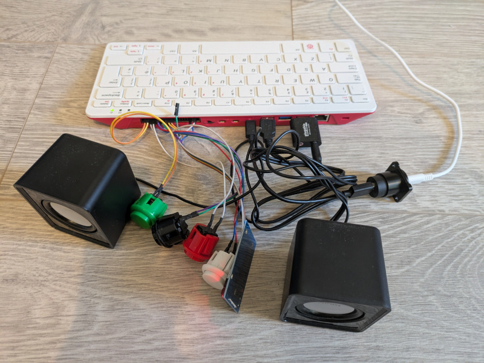

# tunino
** Stories and tunes, the open way. **

Tunino completed:


Tunino inside:


### What is it?
**Let your kids play music or audiobooks with the touch of an RFID tag. No screens. No ads.**

Tunino combines a Raspberry Pi, a RFID Reader and some push buttons into a simple device:
* Scan RFID code to play associtated MP3 file on device.
* Play/pause button: If a piece is playing, press pause and scan new RFID tag to play next song/story.
* One button for volume up. One button for volume down.
* Power button to shutdown securely. (To start, just plug in the USB power cable.)
* That's it.

This is a weekend project that I created for my kids, heavily inspired by [Phoniebox](https://github.com/MiczFlor/RPi-Jukebox-RFID), which I tried to set up
but could not get to run. The scope is for private use by DIY enthusiasts and RPi tinkerers. It's intentionally simple. No CI/CD build, just run from source.
I'm open to accept Pull Requests for added functionality (like other RFID readers, other playback backends), but I won't be able
to provide support.

What happens in the background:
* RPi device runs MPD music server.
* A Python process scans the RFID reader and push buttons, then sends commands to MPD server, acting like a "local remote control".
* The directory with music/audiobook files is published as a network share. Connect with any computer to add new files.
* The network share also has a text file that maps each RFID tag to an MP3 file. Edit this file and add the new file name(s) here.
* MPD needs to be notified of new files. Use any MPD app (for example MaximumMPD) to trigger a file scan. BTW, you can use the MPD app to control the playback as well.

### Hardware setup

The project uses a RC522 RFID reader (with SPI interface!) and arcade-style push buttons. You also need some RFID tags, which you can stick on playing cards,
small figures or similar.  Those items are widely available for small money. I run this on an RPi 400, but I think any Raspberry Pi model should do.

Things to note:
* The Raspberry Pi needs to have SPI interface mode enabled (using `raspi-config`).
* When connecting the push-buttons, note that GPIO pin number is not the same as the physical pin number. For example, physical pin 40 (the last one), is GPIO pin 21.
* I included simple scripts (`test_gpio.py` and `test_rfid.py`) that you can use to check the device connection.
* The script `test_rfid.py` is also handy to read out RFID tag numbers.

### Installation on fresh RPi OS

##### MPD
* Install mpd (and other stuff used later): `sudo apt update; sudo apt upgrade -y; sudo apt install -y mpd python3-rpi-lgpio swig vim samba samba-common-bin`
* In `/etc/mpd.conf`:
  * change `bind_to_address` from `"localhost"` to `"any"`
  * Uncomment `audio_output` for ALSO and add `hw:CARD=Device,DEV=0` (from `aplay -L | grep '^hw:CARD='`)
  * Uncomment `mixer_type` and change to `"software"`
* In `/var/lib/mpd/music/` add a file `rfid_song_map.json` like:
  ```
  {
    "1": "my_song_filename1.mp3",
    "2": "my_song_filename2.mp3",
    "3": "my_song_filename3.mp3"
  }
  ```
* Enable mpd at startup and start it now: `sudo systemctl enable --now mpd`
* In `/etc/samba/smb.conf`:
  * Add following block in `[global]`
    ```
    server string = Tunino Audio Box
    security = user
    guest account = mpd
    ```
  * Comment out section `[homes]` entirely
  * Add following block at the end:
    ```
    [Music]
      path = /var/lib/mpd/music
      browseable = yes
      read only = no
      guest ok = yes
      force user = mpd
      force group = audio
      create mask = 0777
      directory mask = 2777
      public = yes
    ```

##### Tunino
* Generate SSH keys. Add pubkey to GitHub.
* Clone Tunino repo.
* Install uv: `curl -LsSf https://astral.sh/uv/install.sh | sh`
* Remove system-installed lgpio: `sudo apt remove python3-lgpio`
* Install fresh [lgpio library](https://abyz.me.uk/lg/lgpio.html):
  ```
  wget http://abyz.me.uk/lg/lg.zip
  unzip lg.zip
  cd lg
  make
  sudo make install
  ```
* Add a file `tunino/config/.secrects.json` with RFID tag numbers like (you can use `tunino/src/tunino/test_frid.py` to read out the tag numbers):
  ```
  {
    "default": {
      "rfid_map": {
          "1": "012345678901",
          "2": "123456789012",
          "3": "234567890123"
      }
    }
  }
  ```
* Create a service for tunino that autostarts: 
  * Edit `sudo vim /etc/systemd/system/tunino.service` and add:
    ```
    [Unit]
    Description=Tunino - Stories and tunes, the open way.
    After=multi-user.target

    [Service]
    Type=simple
    ExecStart=/home/pi/.local/bin/uv run app
    WorkingDirectory=/home/pi/tunino
    StandardOutput=journal
    StandardError=journal
    Restart=always
    RestartSec=5
    User=pi

    [Install]
    WantedBy=multi-user.target
    ```
  * Then add and start the service:
    ```
    sudo systemctl daemon-reload 
    sudo systemctl enable --now tunino.service
    ```
  * Optional: Check the logs with `journalctl -u tunino.service -f`

##### Optional: Disable builtin RPi400 keyboard (for example before putting all the hardware into a nice case)
  * Run `lsusb` and note the vendor and device id, e.g. `04d9:0007`
  * Create file `sudo vim /etc/udev/rules.d/10-disable-pi400-keyboard.rules` and add:
    ```
    ACTION=="add", ATTR{idVendor}=="04d9", ATTR{idProduct}=="0007", RUN+="/bin/sh -c 'echo 0 > /sys$devpath/authorized'"
    ```
  * Reload `udev` and trigger:
    ```
    sudo udevadm control --reload
    sudo udevadm trigger
    ```
  * Reboot

### License
Apache License v2
